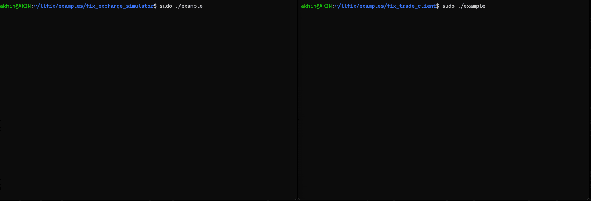
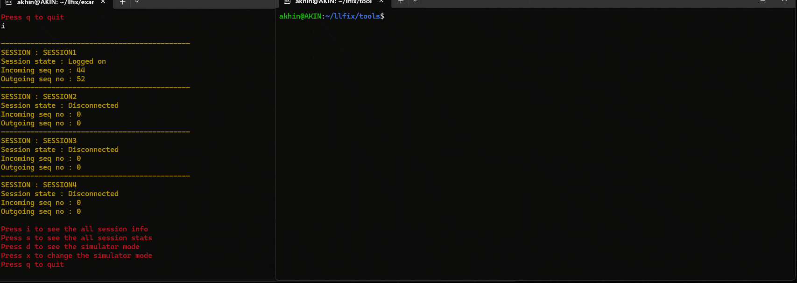

[](https://opensource.org/licenses/MIT)


## **llfix**

This repository contains the open-source edition of llfix, a low latency <a href="https://en.wikipedia.org/wiki/Financial_Information_eXchange" target="_blank">FIX protocol</a> engine (MIT licence).
A separate commercial edition with additional features and support is available at https://www.llfix.net

The main features of the open-source edition:

- Single-digit microsecond message encoding and decoding (including message serialisation & validations)
- Header-only with no mandatory dependencies (only optional dependency is LibNUMA)
- FIX version agnostic, all versions supported
- C++17
- Linux (GCC & Clang) & Windows (MSVC), x86 only
- High determinism : No internal message queueing, no memory allocations on latency-critical paths & vDSO utilisation
- Fast message serialisation via virtual memory
- TCP administration interface & programmatic administration using Python

* [Benchmarks](#benchmarks)
* [Benchmarks against FIX8 and QuickFix](#benchmarks-engines)
* [Examples](#examples)
* [Documentation](#documentation)
* [Message serialisations & deserialiser tool](#serialisations--deserialiser-tool)
* [Administration](#administration)
* [Configs](#configs)
* [Issues and Questions](#issues-and-questions)
* [References](#references)

<a name="benchmarks"></a>
## Benchmarks

Server : 2 x Intel Xeon Gold 6134 (2x8 physical cores @3.2 GHz), 256 GB DDR4, RHEL9.4 & GCC 11.4.1

NIC : Solarflare 8000 Series SFN8522 PLUS, 10GBE

Main tunings : Pinning to isolated CPU cores, disabled hyperthreading, maximised CPU frequency, interleaved RAM access

Timestamps : Timestamps in the benchmarks below are recorded from within the application. They are all CPU based (RDTSCP).

All benchmarks can be found in the benchmarks folder. To build them do "make release".

FIXClient TX/send latency benchmark (with Solarflare Onload): Measured latency includes encoding, message serialisation, and enqueueing to NIC (not wire-to-wire) for 1 million messages ([benchmarks/networked_client_tx](benchmarks/networked_client_tx)):

Message :
8=FIXT.1.1|9=218|35=D|34=2|
49=CLIENT1|52=20251231-18:21:36.457245600|
56=EXECUTOR|50=SNDR_SUB|57=SRVR_SUB|
11=1|55=NOKIA.HE|
54=1|38=10|44=10000|40=2|59=0|
453=2|
448=PARTY1|447=D|452=1|
448=PARTY2|447=D|452=3|
60=20251231-18:21:36.457245600|
10=221|

| Percentile                            | Latency                                                         |
| ------------------------------------- | --------------------------------------------------------------- |
| P50                                   | 573 nanoseconds                                                 |
| P75                                   | 798 nanoseconds                                                 |
| P90                                   | 1044 nanoseconds                                                |
| P95                                   | 1588 nanoseconds                                                |
| P99                                   | 2663 nanoseconds                                                |

Singlethreaded FIXServer benchmark: 4.7 million messages in total from 32 clients, handled by one thread & on loopback, includes message serialisation & validations & sending execution reports ([benchmarks/networked_server_rx](benchmarks/networked_server_rx)):

Message :
8=FIXT.1.1|9=188|35=D|34=2|
49=CLIENT1|52=20251231-17:42:03.736004873|
56=EXECUTOR|11=1|55=BMWG.DE|
54=1|38=1|44=5|40=2|59=0|
453=2|
448=PARTY1|447=D|452=1|
448=PARTY2|447=D|452=3|
60=20251231-17:42:03.736004873|
10=077|

| Metric                | Measurement                |
| --------------------- | -------------------------- |
| Message throughput    | 222423 messages per second |
| Latency per message   | 4.49 microseconds          |

<a name="benchmarks-engines"></a>
## Benchmarks against FIX8 and QuickFix

All cross-engine benchmarks were executed on the same hardware and operating system environment and all three engines (llfix, FIX8, and QuickFIX) were built with -O3 flag.

The previously introduced FIXClient TX/send latency benchmark ([benchmarks/networked_client_tx](benchmarks/networked_client_tx)) was re-implemented for FIX8 ([benchmarks/networked_client_tx_fix8](benchmarks/networked_client_tx_fix8)) and Quickfix ([benchmarks/networked_client_tx_quickfix](benchmarks/networked_client_tx_quickfix)).

The full benchmark source code for all three engines can be found in the `benchmarks` directory. Each benchmark subdirectory contains a `README.md` file describing the reproduction steps.

The combined results for benchmarks run with Onload are shown below :

- Table 1 compares llfix, Fix8, and QuickFIX with file persistence.
- Table 2 compares llfix with file persistence against Fix8 and QuickFIX with memory persistence.

| Percentile | llfix opensource-edition 1.0.0 (with file persistence) | FIX8 1.0.4 (with file persistence) | Quickfix 17 latency (with file persistence) |
| ---------- | -------------------------------------------------------|------------------------------------|-------------------------------------------- |
| P50        | 573 nanoseconds                                        | 4189 nanoseconds                   | 13156 nanoseconds                           |
| P75        | 798 nanoseconds                                        | 4511 nanoseconds                   | 13520 nanoseconds                           |
| P90        | 1044 nanoseconds                                       | 4986 nanoseconds                   | 14703 nanoseconds                           |
| P95        | 1588 nanoseconds                                       | 5743 nanoseconds                   | 15334 nanoseconds                           |
| P99        | 2663 nanoseconds                                       | 12807 nanoseconds                  | 18595 nanoseconds                           |

| Percentile | llfix opensource-edition 1.0.0 (with file persistence) | FIX8 1.0.4 (with memory persistence) | Quickfix 17 latency (with memory persistence)|
| ---------- | -------------------------------------------------------|--------------------------------------|--------------------------------------------- |
| P50        | 573 nanoseconds                                        | 1806 nanoseconds                     | 7341 nanoseconds                             |
| P75        | 798 nanoseconds                                        | 2162 nanoseconds                     | 7571 nanoseconds                             |
| P90        | 1044 nanoseconds                                       | 3573 nanoseconds                     | 7809 nanoseconds                             |
| P95        | 1588 nanoseconds                                       | 5272 nanoseconds                     | 7893 nanoseconds                             |
| P99        | 2663 nanoseconds                                       | 7416 nanoseconds                     | 9323 nanoseconds                             |

<a name="examples"></a>
## Examples

Main examples can be found in the examples directory. For a quick start :

```bash
git clone https://github.com/CorewareLtd/llfix.git
# Building an running the example FIX server
cd llfix/examples/fix_exchange_simulator
mkdir build
cd build
cmake ..
make
./example
# And same for fix_trade_client
```

The following animation shows the FIX client and FIX server examples :



To build with LibNUMA option, specify -DLLFIX_ENABLE_NUMA=ON when running cmake. See engine configs below for NUMA aware allocations.

You can also find other examples under "tests/other_networked_tests" directory :

- "logon_password_authentication" demonstrates specifying logon passwords in FIX clients and validating logon passwords in FIX servers. It also demonstrates setting new logon passwords.
- "raw_data_and_unicode" demonstrates using binary/raw data and unicode characters and sending and handling custom message types.

Repeating groups : In open-source edition, you need to call "specify_repeating_group" for FIX clients and FIX servers. Both examples demonstrate those calls and also encoding/decoding repeating groups.

<a name="documentation"></a>
## Documentation

The commercial edition extends the open-source edition and shares the same core. As a result, the commercial documentation also covers the open-source functionality and is available in the following formats:

- **Online HTML**: https://www.llfix.net/docs/html/
- **PDF**: https://www.llfix.net/docs/llfix_manual.pdf

<a name="serialisations--deserialiser-tool"></a>
## Message serialisations & deserialiser tool

Messages are recorded in a binary format for speed per direction (incoming & outgoing). You should use the deserialiser command line tool in order to view the recorded messages. You can find it in tools directory.

To build it :

- make release on Linux
- use VisualStudio project file on Windows.

CLI options are :

| Option | Description |
| --- | --- |
| -i <path> | Input serialisation path |
| -o <file> | Output file |
| -e | Exclude timestamps from output |
| -t | Use tag names instead of numbers |

The following animation shows the message deserialiser tool decoding recorded FIX messages:


While specifying an input path, it can contain multiple subfolders. It will be recursively searching for all serialisations and sort them based on serialisation timestamp.

By specifying -t, you can also get textual descriptions instead of tag numbers :

```
...
TIMESTAMP=19:46:28.832665400
Success=1
BeginString=FIX.4.4|BodyLength=188|MsgType=D|MsgSeqNum=2|SenderCompID=CLIENT1|SendingTime=20251229-19:46:28.826044800|TargetCompID=EXECUTOR|ClOrdID=1|Symbol=BMWG.DE|Side=1|OrderQty=1|Price=5|OrdType=2|TimeInForce=0|NoPartyIDs=2|PartyID=PARTY1|PartyIDSource=D|PartyRole=1|PartyID=PARTY2|PartyIDSource=D|PartyRole=3|TransactTime=20251229-19:46:28.826044800|CheckSum=027|
----------------------------------------
TIMESTAMP=19:46:28.832693500
Success=1
BeginString=FIX.4.4|BodyLength=188|MsgType=D|MsgSeqNum=2|SenderCompID=CLIENT3|SendingTime=20251229-19:46:28.825434700|TargetCompID=EXECUTOR|ClOrdID=1|Symbol=BMWG.DE|Side=1|OrderQty=1|Price=5|OrdType=2|TimeInForce=0|NoPartyIDs=2|PartyID=PARTY1|PartyIDSource=D|PartyRole=1|PartyID=PARTY2|PartyIDSource=D|PartyRole=3|TransactTime=20251229-19:46:28.825434700|CheckSum=031|
...
```

<a name="admininstration"></a>
## Administration

llfix engine provides a builtin TCP based management interface. You can find "admin_client.py" under tools directory. The following animation shows the admin CLI interacting with a running llfix engine :



The table below lists the available admin interface commands and their descriptions :

| Command                               | Description                                                         |
| ------------------------------------- | ------------------------------------------------------------------- |
| help                                  | Display all available admin CLI commands                            |
| get_uptime                            | Show engine uptime since startup                                    |
| get_engine_version                    | Return the running llfix engine version                             |
| get_engine_log_path                   | Display the current engine log file path                            |
| get_engine_log_level                  | Show the active engine log level                                    |
| set_engine_log_level <log_level>      | Set engine log level (ERROR, WARNING, INFO, DEBUG)                  |
| get_clients                           | List all registered FIX client instances                            |
| get_servers                           | List all registered FIX server instances                            |
| get_instance_config <client/server>   | Display configuration of a client or server instance                |
| get_sessions <client/server>          | List all FIX sessions for a given instance                          |
| get_session_state <c/s> <session>     | Return the current state of a FIX session                           |
| get_session_config <c/s> <session>    | Display configuration of a FIX session                              |
| get_all_session_states                | Show states of all sessions across all instances                    |
| enable_session <c/s> <session>        | Enable a FIX session                                                |
| disable_session <c/s> <session>       | Disable a FIX session                                               |
| get_incoming_sequence_number <c/s> <session>      | Get current incoming sequence number                    |
| get_outgoing_sequence_number <c/s> <session>      | Get current outgoing sequence number                    |
| set_incoming_sequence_number <c/s> <session> <no> | Set incoming sequence number                            |
| set_outgoing_sequence_number <c/s> <session> <no> | Set outgoing sequence number                            |
| send_sequence_reset <c/s> <session> <no>          | Send FIX sequence reset                                 |

You can also programatically send admin commands to manage your sessions using Python. You can find 'programmatic_administration' under examples directory.

<a name="configs"></a>
## Configs

llfix uses a simple, human-readable configuration file format based on INI files similar to Quickfix :

- Lines starting with # are comments
- Configuration entries are organized into groups using square brackets. Group names should be unique:

    [GROUP_NAME]
    key=value

There are 4 config categories :

- Engine : is the single application instance. It can manage multiple FIX clients/servers and abstracts all common and central settings.
- FixClient : represents a FIX client/connector. Configs define network settings, retry behaviour, and NIC bindings for outgoing sessions.
- FixServer : represents a FIX server/acceptor. Configs define accept ports, NIC settings, and connection handling for incoming sessions.
- FixSession : represents an individual FIX session between a client and server. Configs cover protocol version, heartbeat, logon/logoff behaviour, message validations, message serialisation, resends, throttling, scheduling settings.

Example configurations can be found at:

- examples/fix_trade_client/config.cfg - FIX client configuration
- examples/fix_exchange_simulator/config.cfg - FIX server configuration

Both configurations must define an ENGINE group.

Instance names must be unique. For FIX servers, session names must begin with 'SESSION' and be unique.

* [Engine configs](#engine-configs)
* [FIX Client configs](#fix-client-configs)
* [FIX Server configs](#fix-server-configs)
* [FIX Session configs, General](#fix-session-configs-general)
* [FIX Session configs, Header](#fix-session-configs-header)
* [FIX Session configs, Logon and Logout](#fix-session-configs-logon-and-logout)
* [FIX Session configs, Validations](#fix-session-configs-validations)
* [FIX Session configs, Resend Requests](#fix-session-configs-resend-requests)
* [FIX Session configs, Throttler](#fix-session-configs-throttler)
* [FIX Session configs, Serialisation](#fix-session-configs-serialisation)
* [FIX Session configs, Scheduler](#fix-session-configs-scheduler)

<a name="engine-configs"></a>
## Engine configs

| Config                        | Description                                                                                        | Default  |
| ----------------------------- | -------------------------------------------------------------------------------------------------- | -------- |
| log_level                     | Logging verbosity level. One of : ERROR WARNING INFO DEBUG                                         |  INFO    |
| log_file                      | Path to the log output file                                                                        |  log.txt |
| ignore_sighup                 | Ignore SIGHUP signal, affects the entire process (Linux only)                                      |  false   |
| management_server_port        | Port for TCP admin interface                                                                       |  0       |
| management_server_nic_ip      | NIC IP for TCP admin interface                                                                     |          |
| management_server_cpu_core_id | CPU core to pin the admin interface thread                                                         |  -1      |
| numa_bind_node                | NUMA node to bind, affects the entire process (Linux only)                                         |  -1      |
| numa_aware_allocations        | Used together with numa_bind_node. Setup allocations will be from the bound NUMA node (Linux only) |  false   |
| lock_pages                    | Lock the process virtual memory pages using mlockall (Linux only)                                  |  false   |

<a name="fix-client-configs"></a>
## FIX Client configs

| Config                       | Description                                                         | Default |
| -----------------------------| ------------------------------------------------------------------- | ------- |
| cpu_core_id                  | CPU core to pin the FIX client thread                               | -1      |
| nic_address                  | NIC card IP address                                                 |         |
| nic_name                     | NIC card name.                                                      |         |
| primary_address              | Target endpoint IP address                                          |         |
| primary_port                 | Target endpoint port no                                             |         |
| secondary_address            | Secondary target endpoint IP address                                |         |
| secondary_port               | Secondary target endpoint port no                                   |         |
| send_try_count               | Number of send retry attempts on failure. 0 means infinite retries. | 0       |
| socket_rx_size               | Socket receive buffer size in bytes                                 | 212992  |
| socket_tx_size               | Socket transmit buffer size in bytes                                | 212992  |
| rx_buffer_capacity           | Internal receive buffer capacity in bytes                           | 212992  |
| tx_encode_buffer_capacity    | Internal transmit buffer capacity in bytes                          | 212992  |
| disable_nagle                | Disable Nagle's algorithm                                           | true    |
| quick_ack                    | Enable TCP quick acknowledgment                                     | false   |
| receive_size                 | Maximum bytes read per receive call                                 | 4096    |
| async_io_timeout_nanoseconds | Async I/O polling timeout in nanoseconds                            | 1000    |

<a name="fix-server-configs"></a>
## FIX Server configs

| Config                       | Description                                                                                           | Default                             |
| -----------------------------| ----------------------------------------------------------------------------------------------------- | ----------------------------------- |
| cpu_core_id                  | Applies to singlethreaded FIX server. CPU core to pin its thread                                      | -1                                  |
| accept_port                  | Server port used to accept incoming connections                                                       |                                     |
| accept_timeout_seconds       | Timeout for accepting new connections in seconds                                                      | 5                                   |
| nic_address                  | NIC ip address                                                                                        |                                     |
| nic_name                     | NIC card name                                                                                         |                                     |
| send_try_count               | Number of send retry attempts on failure. 0 means infinite retries.                                   | 0                                   |
| socket_rx_size               | Socket receive buffer size in bytes                                                                   | 212992                              |
| socket_tx_size               | Socket transmit buffer size in bytes                                                                  | 212992                              |
| rx_buffer_capacity           | Internal receive buffer capacity in bytes                                                             | 212992                              |
| tx_encode_buffer_capacity    | Internal transmit buffer capacity in bytes                                                            | 212992                              |
| disable_nagle                | Disable Nagle's algorithm                                                                             | true                                |
| quick_ack                    | Enable TCP quick acknowledgment                                                                       | false                               |
| pending_connection_queue_size| Maximum number of pending TCP connection requests                                                     | 32                                  |
| receive_size                 | Maximum bytes read per receive call                                                                   | 4096                                |
| async_io_timeout_nanoseconds | Async I/O polling timeout in nanoseconds                                                              | 1 million on Linux, 1000 on Windows |
| max_poll_events              | Maximum number of events processed per poll cycle                                                     | 64                                  |

<a name="fix-session-configs-general"></a>
## FIX Session configs, General

| Config                                           | Description                                                                              | Default |
| ------------------------------------------------ | ---------------------------------------------------------------------------------------- | ------- |
| heartbeat_interval_seconds                       | FIX heartbeat interval in seconds. Applies to FIX clients only.                          | 30      |
| enable_simd_avx2                                 | If enabled, FIX checksum (tag10) encoding and validations will be done using SIMD AVX2   | false   |
| timestamp_subseconds_precision                   | Subsecond precision used for FIX tag52(sending time). Values are : NANO MICRO MILLI NONE | NANO    |

<a name="fix-session-configs-header"></a>
## FIX Session configs Header

| Config                                           | Description                                                                                                        | Default |
| ------------------------------------------------ | ------------------------------------------------------------------------------------------------------------------ | ------- |
| begin_string                                     | FIX protocol version. One of FIXT.1.1, FIX.4.4, FIX.4.3, FIX.4.2, FIX.4.1, FIX.4.0                                 |         |
| sender_comp_id                                   | SenderCompID identifying this side of the FIX session                                                              |         |
| target_comp_id                                   | TargetCompID identifying the counterparty FIX session                                                              |         |
| additional_static_header_tags                    | Additional static FIX tag value pairs in the following comma separated format : `<tag>=<value>,<tag>=<value>,...`  |         |
| include_last_processed_seqnum_in_header          | Includes last processed sequence number in outgoing message headers tag369                                         | false   |

<a name="fix-session-configs-logon-and-logout"></a>
## FIX Session configs, Logon and Logout

| Config                                           | Description                                                                              | Default |
| ------------------------------------------------ | -----------------------------------------------------------------------------------------| ------- |
| default_app_ver_id                               | Default application version ID sent during logon (tag 1137). Applies to FIX5.0 and later |         |
| logon_username                                   | Username included in the logon message for authentication                                |         |
| logon_password                                   | Password included in the logon message for authentication                                |         |
| logon_message_new_password                       | New password sent during logon for password change workflows                             |         |
| logon_reset_sequence_numbers                     | Requests sequence number reset during logon (tag141)                                     | false   |
| logon_include_next_expected_seq_no               | Includes next expected sequence number in the logon message (tag 789)                    | false   |
| logon_timeout_seconds                            | Time to wait for a logon response before timing out                                      | 5       |
| logout_timeout_seconds                           | Time to wait for logout confirmation before forcefully closing the session               | 5       |

<a name="fix-session-configs-validations"></a>
## FIX Session configs, Validations

| Config                                           | Description                                                                                        | Default |
| ------------------------------------------------ | -------------------------------------------------------------------------------------------------- | ------- |
| validations_enabled                              | Enables or disables all FIX message validations                                                    | true    |
| max_allowed_message_age_seconds                  | Maximum allowed age of incoming messages in seconds based on tag52(sending time). 0 disables check | 0       |
| validate_repeating_groups                        | Enables validation of repeating groups                                                             | false   |

<a name="fix-session-configs-resend-requests"></a>
## FIX Session configs, Resend Requests

| Config                                           | Description                                                                        | Default |
| ------------------------------------------------ | ---------------------------------------------------------------------------------- | ------- |
| replay_messages_on_incoming_resend_request       | If turned on message replaying will be active. If false, gap filling will be used  | false   |
| replay_message_cache_initial_size                | Initial capacity of the message cache used for handling resends                    | 10240   |
| max_resend_range                                 | Maximum number of messages that can be requested in a single resend request        | 10000   |
| include_t97_during_resends                       | Include PossDupFlag (tag 97) on messages resent due to a resend request            | false   |
| outgoing_resend_request_expire_in_secs           | Time in seconds after which an outgoing resend request is considered expired       | 30      |

<a name="fix-session-configs-throttler"></a>
## FIX Session configs, Throttler

| Config                                           | Description                                                                                        | Default                       |
| ------------------------------------------------ | -------------------------------------------------------------------------------------------------- | ----------------------------- |
| throttle_window_in_milliseconds                  | Time window in milliseconds used to measure message rate for throttling                            | 1000                          |
| throttle_limit                                   | Maximum number of messages allowed within the throttle window (0 disables)                         | 0                             |
| throttle_action                                  | Action to take when the throttle limit is exceeded. One of WAIT DISCONNECT REJECT (FixServer only) | WAIT                          |
| throttler_reject_message                         | Message text returned (tag58) when a message is rejected due to throttling (FixServer only)        | "Message rate limit exceeded" |

<a name="fix-session-configs-serialisation"></a>
## FIX Session configs, Serialisation

| Config                                           | Description                                                                                            | Default           |
| ------------------------------------------------ | ------------------------------------------------------------------------------------------------------ | ----------------- |
| sequence_store_file_path                         | File path where FIX sequence numbers are persisted                                                     | sequence.store    |
| incoming_message_serialisation_path              | Directory path for storing serialised incoming FIX messages                                            | messages_incoming |
| outgoing_message_serialisation_path              | Directory path for storing serialised outgoing FIX messages                                            | messages_outgoing |
| max_serialised_file_size                         | Maximum size (in bytes) of a serialised message file before rotation. 0 disables message serialisation | 67108864 (64MB)   |

<a name="fix-session-configs-scheduler"></a>
## FIX Session configs, Scheduler

| Config                                           | Description                                                                                                                | Default |
| ------------------------------------------------ | -------------------------------------------------------------------------------------------------------------------------- |-------- |
| schedule_week_days                               | Days of the week when the FIX session is allowed to run. Should be dash ('-') separated digits from 1(Monday) to 7(Sunday) |         |
| start_hour_utc                                   | UTC hour when the session becomes active (-1 disables scheduling)                                                          | -1      |
| start_minute_utc                                 | UTC minute when the session becomes active. (-1 disables scheduling)                                                       | -1      |
| end_hour_utc                                     | UTC hour when the session stops being active. (-1 disables scheduling)                                                     | -1      |
| end_minute_utc                                   | UTC minute when the session stops being active (-1 disables scheduling)                                                    | -1      |

<a name="issues-and-questions"></a>
## Issues and Questions

If you encounter a bug, have a question about the engine, or would like to suggest an improvement, please use the GitHub features that are enabled in this repository.

Issues — for reporting bugs, unexpected behaviour, or requesting new features.

Discussions — for general questions, usage help, or broader technical discussions related to llfix.

<a name="references"></a>
## References

- Deserialiser tool uses cxxopts library (MIT) : https://github.com/jarro2783/cxxopts
- Benchmarks and test suites use Quickfix and Quickfix dictionaries (The QuickFIX Software Licence) : https://github.com/quickfix/quickfix
- Benchmarks use Fix8 (LGPL-3.0) : https://github.com/fix8/fix8
- Test suites use tinyfix (MIT) : https://github.com/CorewareLtd/tinyfix
- Optional LibNUMA (GNU LGPL) : https://github.com/numactl/numactl
- Documentation is generated using Doxygen (GPL v2) : https://www.doxygen.nl/
- Documentation styling uses doxygen-dark-theme (MIT): https://github.com/MaJerle/doxygen-dark-theme
